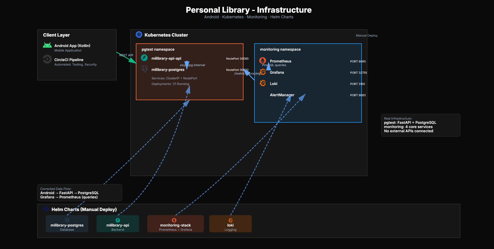

# PersonalLibrary
## Arquitectura

  

## Branching strategy

- `main` — production; protected, updated only through pull requests
- `develop` — integration branch, default branch of the repository
- `feature/*` — branches off `develop`, merges back into `develop` (squash)
- `hotfix/*` — branches off `main`, merges into `main` and is back-merged into `develop`

## Requirements

- Python 3.11+
- Docker
- Helm 3
- Kubernetes (K3s)

## Structure
- Helm